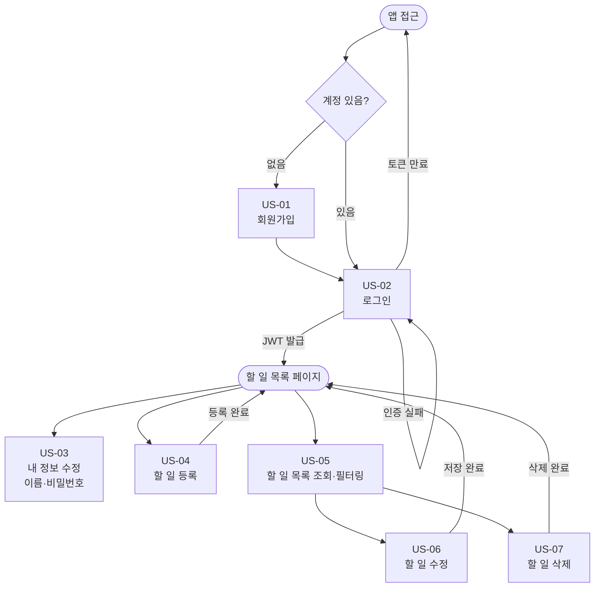
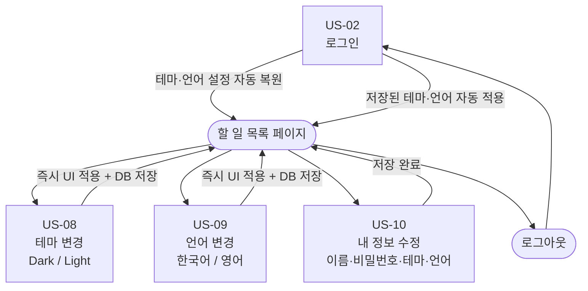

# TodoList 사용자 시나리오

작성일: 2026-05-27
버전: 1.1

| 버전 | 일자 | 변경 내용 |
|------|------|-----------|
| 1.0 | 2026-05-27 | 최초 작성 |
| 1.1 | 2026-05-27 | 시나리오 ID SCN → US 형식 변경, 전체 흐름 섹션 추가 |

---

## 개요

### 페르소나

| 구분 | 페르소나 A | 페르소나 B |
|------|-----------|-----------|
| 이름 | 김지수 | 박민준 |
| 나이/직업 | 23세, 대학생 | 38세, 직장인 (마케터) |
| 사용 환경 | 스마트폰 + 노트북 혼용 | 회사 데스크톱 + 퇴근 후 스마트폰 |
| 주요 목적 | 과제·시험·아르바이트 일정 관리 | 업무 할 일과 개인 할 일을 카테고리별로 구분·추적 |
| 니즈 | 빠른 등록, 한눈에 현황 파악 | 기한 초과 항목 식별, 다국어·다크 모드 선호 |

### 시나리오 목록

| 시나리오 ID | 제목 | 대상 UC | 버전 | 페르소나 |
|------------|------|---------|------|---------|
| US-01 | 신규 회원가입 | UC-01 | v1.0 | A |
| US-02 | 로그인 및 세션 복원 | UC-02 | v1.0 | B |
| US-03 | 내 정보 수정 | UC-03 | v1.0 | B |
| US-04 | 할 일 등록 | UC-04 | v1.0 | A |
| US-05 | 할 일 목록 조회 및 필터링 | UC-05 | v1.0 | B |
| US-06 | 할 일 수정 | UC-06 | v1.0 | A |
| US-07 | 할 일 삭제 | UC-07 | v1.0 | B |
| US-08 | 테마 변경 (Dark/Light Mode) | UC-08 | v2.0 | B |
| US-09 | 언어 변경 (다국어) | UC-09 | v2.0 | B |
| US-10 | 내 정보 수정 (테마·언어 포함) | UC-03 확장 | v2.0 | B |

---

## 전체 흐름

### v1.0 전체 흐름

### v2.0 전체 흐름

### 시나리오 간 의존 관계

| 시나리오 | 선행 조건 | 비고 |
|---------|---------|------|
| US-01 회원가입 | 없음 | 앱 진입점 |
| US-02 로그인 | US-01 완료 | 모든 인증 기능의 전제 |
| US-03 내 정보 수정 | US-02 완료 | — |
| US-04 할 일 등록 | US-02 완료 | — |
| US-05 할 일 목록 조회 | US-02 완료 | US-04 이후 의미 있는 결과 |
| US-06 할 일 수정 | US-05 완료 | 목록에서 항목 선택 |
| US-07 할 일 삭제 | US-05 완료 | 목록에서 항목 선택 |
| US-08 테마 변경 `v2.0` | US-02 완료 | v2.0 배포 후 활성화 |
| US-09 언어 변경 `v2.0` | US-02 완료 | v2.0 배포 후 활성화 |
| US-10 내 정보 수정 확장 `v2.0` | US-02 완료, v2.0 배포 | US-03의 v2.0 확장 |

---

## v1.0 시나리오

---

### US-01: 신규 회원가입

- **시나리오 ID**: US-01
- **대상 UC**: UC-01
- **페르소나**: 페르소나 A (김지수, 대학생)

#### 전제조건
- 앱에 계정이 없는 신규 사용자다.
- 회원가입 페이지에 접근한 상태다.

#### 정상 흐름 (Happy Path)

| 단계 | 행동 |
|------|------|
| 1 | 이메일 입력란에 유효한 이메일 주소를 입력한다. (`jisu@example.com`) |
| 2 | 비밀번호 입력란에 영문·숫자·특수문자를 포함한 8자 이상 128자 이하의 비밀번호를 입력한다. |
| 3 | 이름 입력란에 1자 이상 50자 이하의 이름을 입력한다. |
| 4 | 회원가입 버튼을 클릭한다. |

#### 기대 결과
- 계정이 생성되고 로그인 페이지로 이동한다.
- 회원가입 성공 안내가 표시된다.

#### 예외 흐름 (Exception Path)

| 예외 상황 | 사용자 행동 | 시스템 반응 |
|----------|-----------|-----------|
| 이미 가입된 이메일 입력 | 기존 계정과 동일한 이메일로 제출 | "이미 사용 중인 이메일입니다" 오류 메시지 표시, 제출 차단 |
| 이메일 형식 오류 | `jisu@` 와 같이 불완전한 형식 입력 후 제출 | 이메일 필드에 인라인 형식 오류 메시지 표시 |
| 비밀번호 유효성 미달 | 숫자만으로 구성된 8자 비밀번호 입력 | 비밀번호 필드에 유효성 오류 메시지 표시 |
| 필수 항목 누락 | 이름 미입력 상태로 제출 시도 | 제출 차단, 누락 필드 오류 메시지 표시 |

---

### US-02: 로그인 및 세션 복원

- **시나리오 ID**: US-02
- **대상 UC**: UC-02
- **페르소나**: 페르소나 B (박민준, 직장인)

#### 전제조건
- 이미 가입된 계정이 존재한다.
- 로그인 페이지에 접근한 상태다.

#### 정상 흐름 (Happy Path)

| 단계 | 행동 |
|------|------|
| 1 | 이메일 입력란에 가입된 이메일을 입력한다. |
| 2 | 비밀번호 입력란에 올바른 비밀번호를 입력한다. |
| 3 | 로그인 버튼을 클릭한다. |

#### 기대 결과
- JWT가 발급되어 인증 상태가 유지된다.
- 할 일 목록 페이지로 자동 이동한다.
- 본인의 할 일 목록이 표시된다.

#### 예외 흐름 (Exception Path)

| 예외 상황 | 사용자 행동 | 시스템 반응 |
|----------|-----------|-----------|
| 존재하지 않는 이메일 | 미가입 이메일로 제출 | "이메일 또는 비밀번호가 올바르지 않습니다" 메시지 표시 |
| 비밀번호 불일치 | 올바른 이메일에 잘못된 비밀번호 입력 | "이메일 또는 비밀번호가 올바르지 않습니다" 메시지 표시 |
| 인증 토큰 만료 | 장시간 비활동 후 할 일 목록 접근 | 로그인 페이지로 리다이렉트 |

---

### US-03: 내 정보 수정

- **시나리오 ID**: US-03
- **대상 UC**: UC-03
- **페르소나**: 페르소나 B (박민준, 직장인)

#### 전제조건
- 로그인된 상태다.
- 내 정보 수정 페이지에 접근한 상태다.
- 현재 이름과 비밀번호가 화면에 표시되어 있다.

#### 정상 흐름 (Happy Path)

| 단계 | 행동 |
|------|------|
| 1 | 이름 필드를 수정한다. |
| 2 | 비밀번호 변경을 원할 경우 현재 비밀번호를 입력한다. |
| 3 | 새 비밀번호와 확인 비밀번호를 입력한다. |
| 4 | 저장 버튼을 클릭한다. |

#### 기대 결과
- 변경된 이름이 즉시 반영된다.
- 성공 메시지가 표시된다.

#### 예외 흐름 (Exception Path)

| 예외 상황 | 사용자 행동 | 시스템 반응 |
|----------|-----------|-----------|
| 현재 비밀번호 불일치 | 틀린 현재 비밀번호 입력 후 저장 | "현재 비밀번호가 올바르지 않습니다" 메시지 표시 |
| 이름 유효성 오류 | 이름 필드를 비워두거나 50자 초과 입력 | 해당 필드 인라인 오류 메시지 표시 |
| 새 비밀번호 유효성 미달 | 유효성 조건 미충족 비밀번호 입력 | 비밀번호 필드 인라인 오류 메시지 표시 |

---

### US-04: 할 일 등록

- **시나리오 ID**: US-04
- **대상 UC**: UC-04
- **페르소나**: 페르소나 A (김지수, 대학생)

#### 전제조건
- 로그인된 상태다.
- 할 일 등록 폼이 열려있는 상태다.

#### 정상 흐름 (Happy Path)

| 단계 | 행동 |
|------|------|
| 1 | 제목 입력란에 할 일 제목을 입력한다. (예: "통계학 과제 제출") |
| 2 | 설명 입력란에 상세 내용을 선택적으로 입력한다. |
| 3 | 카테고리를 선택한다. (미선택 시 '기본' 자동 적용) |
| 4 | 캘린더에서 시작일자와 종료일자를 선택한다. (선택 사항) |
| 5 | 저장 버튼을 클릭한다. |

#### 기대 결과
- 새 할 일이 목록에 추가된다.
- 날짜 지정 시 오늘 날짜를 기준으로 상태(시작 전/진행 중)가 자동 계산되어 표시된다.
- 날짜 미지정 시 상태가 '진행 중'으로 표시된다.

#### 예외 흐름 (Exception Path)

| 예외 상황 | 사용자 행동 | 시스템 반응 |
|----------|-----------|-----------|
| 제목 미입력 | 제목 없이 저장 시도 | 제출 차단, "제목을 입력해 주세요" 메시지 표시 |
| 날짜 역순 입력 | 종료일자를 시작일자보다 이전 날짜로 선택 | "종료일자는 시작일자 이후여야 합니다" 메시지 표시 |
| 미인증 상태 접근 | 로그인 없이 등록 시도 | 401 응답, 로그인 페이지로 이동 |

---

### US-05: 할 일 목록 조회 및 필터링

- **시나리오 ID**: US-05
- **대상 UC**: UC-05
- **페르소나**: 페르소나 B (박민준, 직장인)

#### 전제조건
- 로그인된 상태다.
- 등록된 할 일이 여러 카테고리와 상태로 존재한다.
- 할 일 목록 페이지에 있다.

#### 정상 흐름 (Happy Path)

| 단계 | 행동 |
|------|------|
| 1 | 할 일 목록 페이지에 진입하면 전체 할 일이 표시된다. |
| 2 | 카테고리 필터에서 특정 카테고리를 선택한다. |
| 3 | 상태 필터에서 '기한 초과'를 선택한다. |
| 4 | 필터 조건에 맞는 할 일만 목록에 표시된다. |

#### 기대 결과
- 각 할 일 항목에 제목, 상태, 카테고리, 날짜가 표시된다.
- 상태는 오늘 날짜 기준으로 자동 계산되어 표시된다.
  - 시작 전: 오늘 < 시작일자
  - 진행 중: 시작일자 <= 오늘 <= 종료일자
  - 완료: 완료 여부 = true
  - 기한 초과: 오늘 > 종료일자
  - 진행 중 (날짜 없음): 날짜 미지정 && 완료=false
- 필터 적용 시 해당 조건의 할 일만 표시된다.

#### 예외 흐름 (Exception Path)

| 예외 상황 | 사용자 행동 | 시스템 반응 |
|----------|-----------|-----------|
| 미인증 상태 접근 | 로그인 없이 목록 페이지 접근 | 401 응답, 로그인 페이지로 이동 |
| 등록된 할 일 없음 | 목록 페이지 진입 시 할 일 없음 | "등록된 할 일이 없습니다" 안내 문구 표시 |
| 필터 결과 없음 | 조건에 해당하는 항목 없음 | 빈 목록 상태로 표시 |

---

### US-06: 할 일 수정

- **시나리오 ID**: US-06
- **대상 UC**: UC-06
- **페르소나**: 페르소나 A (김지수, 대학생)

#### 전제조건
- 로그인된 상태다.
- 본인이 등록한 할 일이 목록에 존재한다.

#### 정상 흐름 (Happy Path)

| 단계 | 행동 |
|------|------|
| 1 | 수정할 할 일 항목의 수정 버튼을 클릭한다. |
| 2 | 기존 데이터가 폼에 채워진 상태로 수정 화면이 열린다. |
| 3 | 제목, 설명, 카테고리, 날짜, 완료 여부 중 원하는 항목을 변경한다. |
| 4 | 저장 버튼을 클릭한다. |

#### 기대 결과
- 변경된 내용이 목록에 즉시 반영된다.
- 날짜 또는 완료 여부 변경 시 상태가 재계산되어 갱신된다.

#### 예외 흐름 (Exception Path)

| 예외 상황 | 사용자 행동 | 시스템 반응 |
|----------|-----------|-----------|
| 타인의 할 일 수정 시도 | URL 조작 등으로 타인 할 일 수정 요청 | 403 응답, 수정 차단 |
| 미인증 상태 요청 | 세션 만료 후 수정 시도 | 401 응답, 로그인 페이지로 이동 |
| 날짜 역순 입력 | 종료일자를 시작일자 이전으로 변경 | "종료일자는 시작일자 이후여야 합니다" 메시지 표시 |

---

### US-07: 할 일 삭제

- **시나리오 ID**: US-07
- **대상 UC**: UC-07
- **페르소나**: 페르소나 B (박민준, 직장인)

#### 전제조건
- 로그인된 상태다.
- 본인이 등록한 할 일이 목록에 존재한다.

#### 정상 흐름 (Happy Path)

| 단계 | 행동 |
|------|------|
| 1 | 삭제할 할 일 항목의 삭제 버튼을 클릭한다. |
| 2 | "삭제하시겠습니까?" 확인 다이얼로그가 표시된다. |
| 3 | 확인 버튼을 클릭한다. |

#### 기대 결과
- 해당 할 일이 목록에서 즉시 제거된다.

#### 예외 흐름 (Exception Path)

| 예외 상황 | 사용자 행동 | 시스템 반응 |
|----------|-----------|-----------|
| 삭제 취소 | 확인 다이얼로그에서 취소 버튼 클릭 | 다이얼로그 닫힘, 할 일 유지 |
| 타인의 할 일 삭제 시도 | URL 조작 등으로 타인 할 일 삭제 요청 | 403 응답, 삭제 차단 |
| 미인증 상태 요청 | 세션 만료 후 삭제 시도 | 401 응답, 로그인 페이지로 이동 |

---

## v2.0 시나리오

---

### US-08: 테마 변경 (Dark/Light Mode)

- **시나리오 ID**: US-08
- **대상 UC**: UC-08
- **페르소나**: 페르소나 B (박민준, 직장인)

#### 전제조건
- 로그인된 상태다.
- 현재 Light 테마가 적용되어 있다.

#### 정상 흐름 (Happy Path)

| 단계 | 행동 |
|------|------|
| 1 | 헤더의 테마 토글 버튼을 클릭한다. |
| 2 | 전체 UI가 즉시 Dark 모드로 전환된다. |
| 3 | 선택된 테마 값(`dark`)이 서버 DB에 저장된다. |
| 4 | 이후 재로그인 시 Dark 테마가 자동으로 복원된다. |

#### 기대 결과
- 테마 변경이 페이지 새로고침 없이 즉시 적용된다.
- 로그아웃 후 재로그인해도 마지막 선택 테마가 유지된다.

#### 예외 흐름 (Exception Path)

| 예외 상황 | 사용자 행동 | 시스템 반응 |
|----------|-----------|-----------|
| DB 저장 실패 | 테마 토글 클릭 시 네트워크 오류 등 발생 | UI 테마 전환은 유지, 토스트 알림으로 "저장에 실패했습니다" 안내 |
| 미로그인 상태 테마 변경 | 로그인 전 테마 토글 조작 | 브라우저 로컬스토리지에 임시 저장, 로그인 후 DB 값으로 덮어씀 |

---

### US-09: 언어 변경 (다국어)

- **시나리오 ID**: US-09
- **대상 UC**: UC-09
- **페르소나**: 페르소나 B (박민준, 직장인)

#### 전제조건
- 로그인된 상태다.
- 현재 한국어(`ko`)가 적용되어 있다.

#### 정상 흐름 (Happy Path)

| 단계 | 행동 |
|------|------|
| 1 | 헤더의 언어 선택 영역에서 영어(`en`)를 선택한다. |
| 2 | 전체 UI 텍스트가 즉시 영어로 전환된다. |
| 3 | 선택된 언어 코드(`en`)가 서버 DB에 저장된다. |
| 4 | 이후 재로그인 시 영어 설정이 자동으로 복원된다. |

#### 기대 결과
- 언어 변경이 페이지 새로고침 없이 즉시 적용된다.
- 로그아웃 후 재로그인해도 마지막 선택 언어가 유지된다.

#### 예외 흐름 (Exception Path)

| 예외 상황 | 사용자 행동 | 시스템 반응 |
|----------|-----------|-----------|
| 지원하지 않는 언어 코드 | 비정상 언어 코드 전달 (예: `fr`) | 기본값 `ko` 적용 |
| DB 저장 실패 | 언어 선택 시 네트워크 오류 등 발생 | UI 언어 전환은 유지, 토스트 알림으로 "저장에 실패했습니다" 안내 |
| 미로그인 상태 언어 변경 | 로그인 전 언어 선택 조작 | 브라우저 로컬스토리지에 임시 저장, 로그인 후 DB 값으로 덮어씀 |

---

### US-10: 내 정보 수정 (테마·언어 포함)

- **시나리오 ID**: US-10
- **대상 UC**: UC-03 확장 (v2.0)
- **페르소나**: 페르소나 B (박민준, 직장인)

#### 전제조건
- 로그인된 상태다.
- v2.0이 적용된 내 정보 수정 페이지에 접근한 상태다.
- 이름, 비밀번호 항목 외에 테마·언어 선택 항목이 표시된다.

#### 정상 흐름 (Happy Path)

| 단계 | 행동 |
|------|------|
| 1 | 내 정보 수정 페이지에서 테마 항목을 `dark`로 변경한다. |
| 2 | 언어 항목을 `en`으로 변경한다. |
| 3 | 저장 버튼을 클릭한다. |
| 4 | 테마와 언어가 즉시 UI에 적용되고 DB에 저장된다. |

#### 기대 결과
- 테마와 언어 변경이 즉시 화면에 반영된다.
- 성공 메시지가 표시된다.
- 이후 재로그인 시 저장된 테마·언어가 자동 복원된다.

#### 예외 흐름 (Exception Path)

| 예외 상황 | 사용자 행동 | 시스템 반응 |
|----------|-----------|-----------|
| 테마·언어 저장 실패 | 저장 요청 시 네트워크 오류 등 발생 | UI 적용은 유지, 토스트 알림으로 "저장에 실패했습니다" 안내 |
| 비밀번호 동시 변경 시 현재 비밀번호 불일치 | 현재 비밀번호 오입력 후 저장 | "현재 비밀번호가 올바르지 않습니다" 메시지 표시, 저장 차단 |
