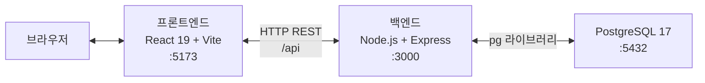
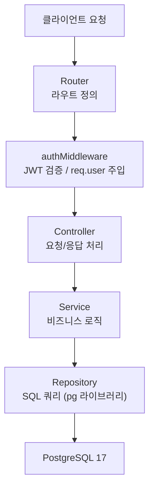
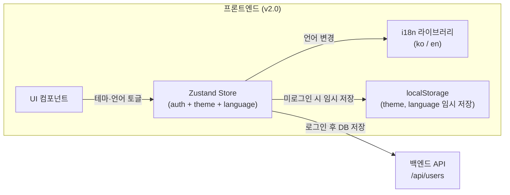
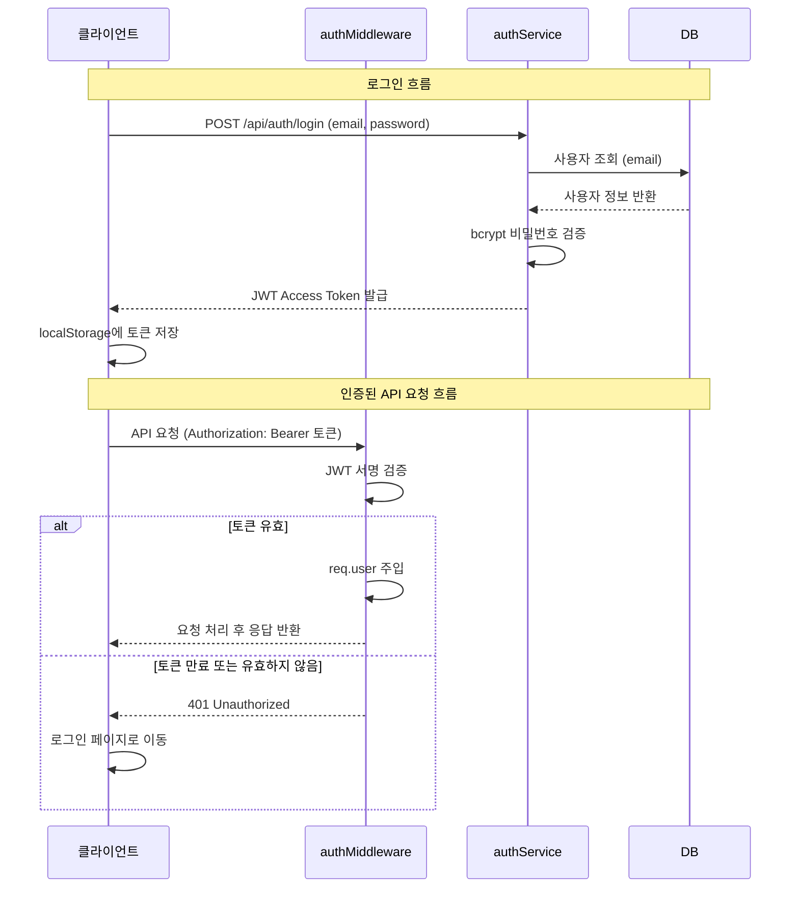

# 기술 아키텍처 다이어그램

| 항목 | 내용 |
|------|------|
| 버전 | 1.1 |
| 작성일 | 2026-05-27 |
| 참조 문서 | docs/2-PRD.md v2.0, docs/4-project-structure.md v1.0 |

| 버전 | 일자 | 변경 내용 |
|------|------|-----------|
| 1.0 | 2026-05-27 | 최초 작성 |
| 1.1 | 2026-05-27 | PostgreSQL 버전(17) 명시, i18n(v2.0) 반영 |

---

## 다이어그램 1: 시스템 전체 구조

---

## 다이어그램 2: 백엔드 레이어 구조

---

## 다이어그램 3: v2.0 프론트엔드 확장 구조 `v2.0`

---

## 다이어그램 4: 인증 흐름

