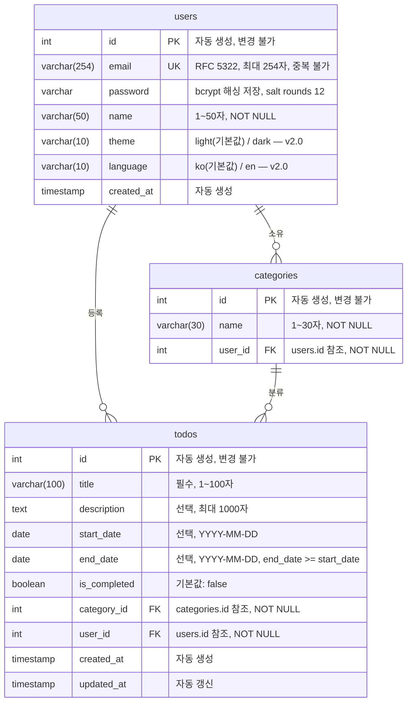

# ERD (Entity Relationship Diagram)

| 항목 | 내용 |
|------|------|
| 버전 | 1.0 |
| 작성일 | 2026-05-27 |
| 참조 문서 | docs/1-domain-definition.md v1.2, docs/2-PRD.md v2.0 |

---

## 엔티티 관계도

---

## 컬럼 설명

### users

| 컬럼 | 타입 | 제약 | 설명 |
|------|------|------|------|
| id | int | PK, NOT NULL | 자동 생성, 변경 불가 |
| email | varchar(254) | UK, NOT NULL | RFC 5322 형식, 최대 254자, 중복 불가 |
| password | varchar | NOT NULL | bcrypt 해싱 저장 (salt rounds 12) |
| name | varchar(50) | NOT NULL | 1~50자 |
| theme | varchar(10) | DEFAULT 'light' | 'light' / 'dark' — v2.0 추가 |
| language | varchar(10) | DEFAULT 'ko' | 'ko' / 'en' — v2.0 추가 |
| created_at | timestamp | NOT NULL | 자동 생성 |

### categories

| 컬럼 | 타입 | 제약 | 설명 |
|------|------|------|------|
| id | int | PK, NOT NULL | 자동 생성, 변경 불가 |
| name | varchar(30) | NOT NULL | 1~30자 |
| user_id | int | FK → users.id, NOT NULL | 카테고리 소유자 |

비고:
- '기본' 카테고리는 시스템 제공, 삭제 불가 (DR-CAT-02)
- 할 일 등록 시 카테고리 미지정이면 '기본' 자동 적용 (DR-CAT-01)

### todos

| 컬럼 | 타입 | 제약 | 설명 |
|------|------|------|------|
| id | int | PK, NOT NULL | 자동 생성, 변경 불가 |
| title | varchar(100) | NOT NULL | 1~100자 |
| description | text | NULL 허용 | 최대 1,000자 |
| start_date | date | NULL 허용 | YYYY-MM-DD 형식 |
| end_date | date | NULL 허용 | YYYY-MM-DD, end_date >= start_date |
| is_completed | boolean | DEFAULT false | 완료 여부 |
| category_id | int | FK → categories.id, NOT NULL | 분류 카테고리 |
| user_id | int | FK → users.id, NOT NULL | 할 일 등록자 |
| created_at | timestamp | NOT NULL | 자동 생성 |
| updated_at | timestamp | NOT NULL | 자동 갱신 |

---

## 상태 계산 규칙

status 컬럼은 DB에 저장하지 않으며, 런타임에 아래 규칙으로 계산한다.

| 상태 | 조건 |
|------|------|
| 시작 전 | is_completed=false, 오늘 < start_date |
| 진행 중 | is_completed=false, start_date <= 오늘 <= end_date |
| 완료 | is_completed=true (날짜 무관) |
| 기한 초과 | is_completed=false, 오늘 > end_date |
| 진행 중 (날짜 없음) | is_completed=false, start_date·end_date 모두 NULL |
